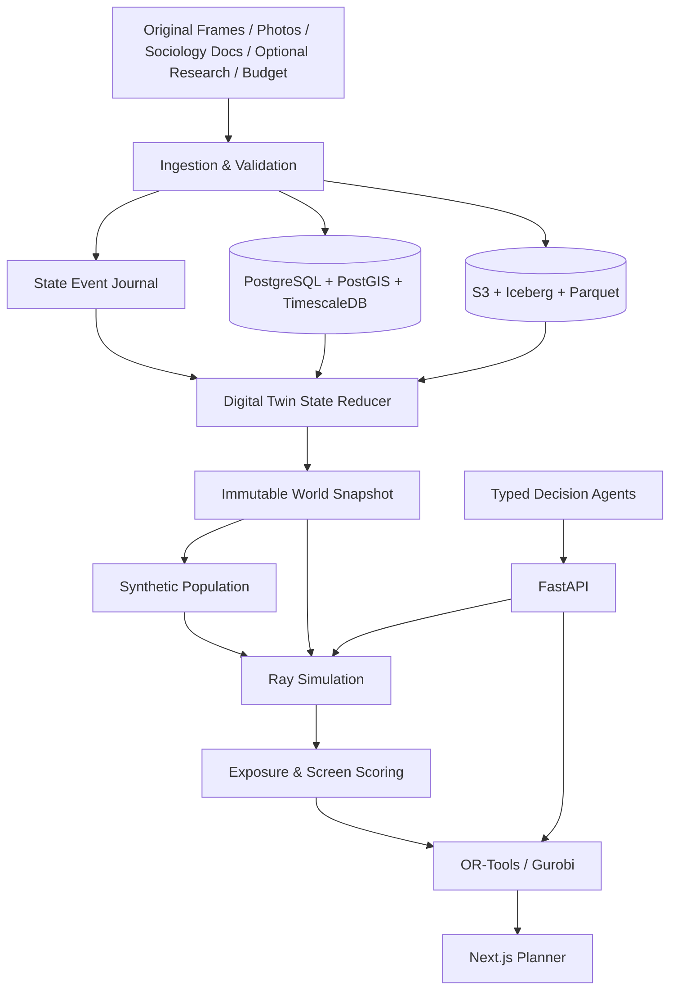

# AI-Native pDOOH Digital Twin & Optimization Platform

> 面向程序化数字户外广告（pDOOH）的城市数字孪生、合成人口仿真、效果预测与媒体组合优化平台。

> **项目状态：Architecture / Specification。** 当前仓库尚未包含可运行服务；下文是目标技术架构与研发契约。

## 1. 核心设计

本项目保留 NEXUS 的多源接入、Agent 协作和闭环决策思想，但不使用 Knowledge Graph。世界模型由 **DOOH Digital Twin 状态空间**表达：

$$
World_t=\{S_t,A_t,E_t\}
$$

其中的状态变量为：

$$
S_t,\quad A_t,\quad E_t
$$

- Environment State：必选字段包含 location、screen、POI、price、impressions、availability 和 photo context；traffic、weather、urban event 仅在有额外数据源时启用。
- Representative Agent/Cohort State：position、activity、mode、route 和 cohort weight。
- Event State：movement、screen passage 和 view opportunity。

状态通过版本化转移函数演进：

$$
World_{t+1}=F_\theta(World_t,U_t,\epsilon_t)
$$

$$
U_t,\quad \epsilon_t,\quad F_\theta
$$

三者依次表示 Budget/SOT 等规划条件、固定 seed 控制的随机扰动，以及 State Reducer、Mobility、Exposure 和 Screen Scoring 模型的组合。

```text
City
  -> Region
     -> Location Cell
        -> Screen Object
        -> Audience Flow
           -> Exposure Event
```

这些层级通过外键、H3、PostGIS 空间关系和时间索引组织，不构建语义图谱。

## 2. 总体架构



端到端流程：

```text
Raw Data
  -> Parse / Map / Validate
  -> Canonical Objects
  -> Observation Events
  -> World Snapshot
  -> Synthetic Population
  -> Mobility & Exposure Simulation
  -> Exposure Potential & Screen Scoring
  -> Budget / Screen / SOT Optimization
  -> Human Approval
  -> FilteredFrames / Proposal / PICS
```

## 3. 技术栈

| 层 | 技术 | 用途 |
|---|---|---|
| API | Python 3.12、FastAPI、Pydantic v2 | 类型化 REST API 和 OpenAPI |
| Workflow | Temporal | 长任务、重试、补偿和人工审批 |
| Batch | Polars、GeoPandas；规模化后 Spark | 库存、GIS、日志和特征处理 |
| Streaming | Kafka API / Redpanda | Observation 和 State Change 事件 |
| OLTP/Geo/Time | PostgreSQL、PostGIS、TimescaleDB | Canonical facts、空间和近期状态 |
| State History | S3、Iceberg、Parquet | 不可变状态、事件和训练数据 |
| Evidence Search | PostgreSQL FTS、Qdrant | 社会学文献、内部调研和图片证据检索 |
| Simulation | Ray、Arrow | 分布式状态转移和场景并行 |
| ML | PyTorch、PyG、scikit-learn、MLflow | Screen scoring、曝光估计、校准和模型治理 |
| Optimization | OR-Tools；可选 Gurobi | MILP/CP-SAT 与鲁棒优化 |
| Agent | LangGraph + Typed Tools | 决策编排、解释和审批 |
| Frontend | TypeScript、Next.js、React、MapLibre | 地图、场景、方案对比 |
| Observability | OpenTelemetry、Prometheus、Grafana、Loki、Tempo | Metrics、logs 和 traces |
| Deployment | Docker Compose、Kubernetes、Helm、Terraform | 本地与生产部署 |

## 4. Digital Twin 状态模型

### 4.1 状态对象

| 状态 | 主键 | 核心字段 |
|---|---|---|
| LocationCellState | `cell_id + time_bucket` | location、POI、venue、photo context；可选 traffic/weather/event |
| ScreenState | `screen_id + time_bucket` | availability、SOT、price、brightness、media capability |
| AudienceFlowState | `cell_id + segment_id + time_bucket` | inflow、outflow、dwell、mode |
| Agent/CohortState | `id + time_bucket` | position、activity、mode、route、cohort weight |
| TwinEvent | `event_id` | event_time、source、object、payload、revision |
| WorldSnapshot | `snapshot_id` | parent、state_at、partitions、offsets、versions、hash |

所有对象使用 UUIDv7；坐标统一 WGS84；距离使用 PostGIS `geography`；金额使用 `NUMERIC/Decimal`。

### 4.2 事件来源

```text
OBSERVED      真实库存、价格、可售状态和环境资料
INTERVENTION  Budget、SOT、供应或情景修改
DERIVED       确定性特征和聚合结果
SIMULATED     仿真生成的移动、曝光机会和评分
CORRECTION    经过审批的历史事实更正
```

State Reducer 按 `(event_time, priority, event_id)` 稳定排序：

```text
load parent snapshot
  -> validate event schema and revision
  -> apply reducers and model transitions
  -> validate state invariants
  -> write immutable partitions
  -> compute hashes
  -> publish snapshot atomically
```

反事实 Scenario 从生产 Snapshot 创建 copy-on-write branch，绝不修改生产状态。

### 4.3 Snapshot 契约

```json
{
  "world_snapshot_id": "019...",
  "parent_snapshot_id": "019...",
  "city_id": "gb-london",
  "state_at": "2026-10-01T17:00:00Z",
  "schema_version": "world-state.v1",
  "reducer_version": "twin-reducer-4",
  "partition_manifest_uri": "s3://.../manifest.json",
  "event_offsets": {"partition-0": 48192},
  "model_versions": ["mobility-12", "viewability-7"],
  "state_sha256": "..."
}
```

仿真必须绑定一个 `PUBLISHED` Snapshot，不允许读取未固定的“最新数据”。

## 5. 数据接入

### 5.1 用户提供的输入

```text
Required
├── Original Frame Excel
├── 目标国家/地区的消费力、观念与文化价值观文献
├── Total Budget + Currency
└── 每块屏幕的现场照片

Optional
└── 公司内部对该地区消费者的群体画像调研
```

当前不把完整 Campaign Brief、广告创意、个人轨迹或历史投放反馈设为必选输入。若没有投放日期或 Campaign days，只输出预算级建议；最终交易结果需补充日期参数。

### 5.2 Original Frame Schema

`data/test.xlsx` 的 `UnfilteredFrames` 表头是库存接入契约：

```text
Identity
  GEOM, SSP, MARKET, VIOOH_ID, ASSETUUID, VISUAL_UNIT_CODE

Region
  ADDRESS_THOROUGHFARE, ADDRESS_ADMINISTRATIVE_AREA, ADDRESS_LOCALITY
  ADDRESS_POSTAL_CODE, ADDRESS_COUNTRY, ADDRESS_ISO3_COUNTRY_CODE
  LATITUDE, LONGITUDE, IATA

Screen Specification
  PRODUCT_FORMAT_NAME, DIGITAL_SPEC_WIDTH, DIGITAL_SPEC_HEIGHT
  WIDTHXHEIGHT, ASPECT_RATIO, DIGITAL_SPEC_MOTION_TYPE
  DIGITAL_SPEC_FPS, DIGITAL_SPEC_ROTATION, SLOT_DURATION

Venue / POI
  VENUE_TAXONOMY_ID, VENUE_TAXONOMY_VALUE
  CLOSEST_POI, DISTANCE_TO_CLOSEST_POI

Commercial / Reach
  IMPRESSIONS, FLOORCPM, MEDIAOWNERCURRENCY
  VIOOHSELECTOPTIN, SCORE_P

Photo
  FRAMEIMAGEPATH
```

源文件中的 `CLOEST_POI` 作为 `CLOSEST_POI` 的兼容别名处理。原始列保持不变，标准化值写入处理层。

同一工作簿还定义了下游契约：`FilteredFrames` 继承 Frame 字段；`POI` 使用 `ADDRESS_COUNTRY, Location, POI` 补充目标范围；`Proposal` 和 `PICS` 作为最终导出，字段见优化输出。

### 5.3 接入流程

1. 原始文件写入不可变 S3 路径并计算 SHA-256。
2. 解析 XLSX、照片、PDF/DOCX/PPTX，执行安全检查。
3. 使用国家、行政区、城市、邮编、IATA 和经纬度锁定目标区域。
4. 校验屏幕 ID、坐标、尺寸、曝光、底价、币种、POI 和可售状态。
5. 错误记录进入 quarantine，不用默认值掩盖异常。
6. 使用 PostGIS/H3 计算邻近关系和 Screen Exposure Zone；额外 POI、道路或客流数据只有在明确接入并记录来源后才参与计算。
7. VLM 从现场照片提取可见性与环境特征，不识别照片中的个人。
8. 社会学文献和可选内部调研按 page/bbox 建立 Evidence Index。
9. Canonical change 转换为 Observation Candidate；审核后进入 Reducer。

文档抽取只生成带原文引用的 `EvidenceClaim`，必须经过单位、时间、地域和置信度校验，不能直接修改 Twin 状态。

## 6. Representative Population 与 Mobility

平台根据国家社会学文献、可选内部消费者调研，以及 Frame 中的 Venue/POI/位置和照片环境，构建代表性人群 Cohort。它不复制或跟踪真实个人。

```text
国家/区域消费与文化资料
+ 可选内部群体画像
+ Venue / POI / Location Context
-> Representative Cohorts
-> 可能的活动、移动方式与经过场景
```

如果后续获得合法的人口统计、道路网络、OD 或客流聚合表，可使用 IPF/IPU 和 Mobility Calibration 进行量化校准；在没有这些数据时，系统必须降低置信度，不能把文献推断描述为精确人口分布或真实路线。

Mobility 状态：

$$
M_{c,t}=(location\_cell,venue,activity,mode,dwell\_band,weight)
$$

基线模型按 Location Cell、Venue 与 Cohort 推演经过概率；只有接入道路网络和聚合客流后，才启用 route 与 Screen Exposure Zone 相交计算。道路仅作为路径算法的封闭拓扑数据，不承担语义推理。

## 7. Exposure 与 Screen Importance

### 7.1 Exposure Opportunity

对每个 Agent、Screen 和时间点：

$$
p_{view}=\sigma(\beta_0+\beta_1\log(1+\omega)+\beta_2\cos\theta-\beta_3\log(1+d)+\beta_4\Delta t-\beta_5 occlusion)\times p_{slot}
$$

输入包括距离、角度、屏幕视角面积、移动速度、停留、遮挡、环境和播放时长。`IMPRESSIONS` 是原始曝光基准；照片和空间环境用于修正屏幕是否容易被看见。

### 7.2 Screen Importance Score

$$
Score_s=w_EE_s+w_VV_s+w_LL_s+w_MM_s+w_CC_s+w_AA_s-w_UU_s
$$

$$
(E_s,V_s,L_s,M_s,C_s,A_s,U_s)
$$

- Exposure Potential：`IMPRESSIONS` 与可能经过人群。
- Visibility：尺寸、比例、位置、照片视线与遮挡。
- Location Value：Venue、POI、距离和区域角色。
- Market Relevance：当地消费力、观念、文化价值观与可选内部画像。
- Cost Efficiency：`FLOORCPM + MEDIAOWNERCURRENCY`。
- Availability：`VIOOHSELECTOPTIN`、资源状态和字段完整性。
- Uncertainty：缺失数据和推断风险。

各维度先在目标区域内归一化。MVP 权重由可审计配置给出，并满足：

$$
\sum_k w_k=1,\quad w_k\ge0
$$

`SCORE_P` 只用于对照和异常检查；没有历史效果标签时，不把这些权重描述为从效果数据中学习得到。

### 7.3 指标

```text
raw_impressions
-> adjusted_exposure_opportunity
-> visibility_score
-> location_score
-> market_relevance_score
-> cost_efficiency
-> screen_importance_score
-> confidence_range
```

由于当前输入不包含广告创意、个人级触达或投后结果，MVP 不直接承诺 Creative Attention、Unique Reach、Recall、Conversion 或 Uplift。它输出屏幕层面的曝光机会、环境适配度、重要性和不确定性。

## 8. 仿真引擎

Simulation Agent 是轻量状态行或 Cohort，不是 LLM Agent。

```text
load World Snapshot and population partitions
for each time window:
  update mobility state
  generate route-screen intersections
  calculate view opportunity
  aggregate screen × location × cohort metrics
  calculate screen importance dimensions
persist metric cube and quality report
```

Ray Task 只传 manifest URI 和 partition ID；中间状态使用 Arrow/Parquet。随机流由 `scenario_seed + partition + module + replicate` 派生，保证重试可复现。

输出 Metric Cube：

```text
scenario_id, screen_id, location_cell, cohort_id
raw_impressions, exposure_opportunity, visibility_score
location_score, market_score, cost_efficiency
screen_importance_score, uncertainty, quality_flags
```

## 9. Budget / Screen / SOT Optimization

决策变量：

$$
x_s\in\{0,1\},\quad q_s\in[0,1],\quad b_s\ge0
$$

三者依次表示是否选择该 Screen、Suggested SOT，以及分配给该 Screen 的预算。

目标：

$$
\max \sum_s x_s q_s\left(w_E Exposure_s+w_V Visibility_s+w_L Location_s+w_M Market_s-w_C Cost_s-w_U Uncertainty_s\right)
$$

硬约束：

$$
TotalCost \le Budget
$$

$$
0\le q_s\le AvailableSOT_s
$$

- Screen 必须位于 Excel 锁定的目标区域。
- Screen 必须满足 `VIOOHSELECTOPTIN` 和资源完整性要求。
- 成本必须使用 `FLOORCPM`、媒体币种、预算币种与统一汇率时点计算。
- 若提供 Date/Campaign days，交付曝光按周期和 Suggested SOT 调整。

求解流程：

```text
eligibility filter
-> dominance pruning
-> OR-Tools/Gurobi solve
-> top-K exposure simulation
-> nonlinear re-ranking
-> independent constraint validation
-> human approval
```

返回求解状态、optimality gap、预算 slack、建议屏幕数、Suggested SOT、Impression deliverable、Media Budget、DSP fee 与 Total investment。不可行时返回预算或可售资源限制，不自动修改输入预算。

导出字段严格对齐工作簿：

```text
Proposal
  Date, Country, POI, Venue type
  Floor price 2026 CPM, VIOOHSELECTCPMLOCAL
  Floor price 2026 CPM (VS), Floor price 2026 CPM (USD)
  Screen no., Monthly impressions, Campaign days
  Suggested screen no, Suggested SOT, Impression deliverable
  Media Budget (USD), DSP fee, Total investment

PICS
  Market, Country, VenueType, PickedImageCount, Image1, Image2, Image3
```

当预算币种不是 USD 时，计算与主结果使用用户币种，并保留工作簿要求的 USD 参考列及汇率时点。

## 10. Decision Agents

| Agent | 作用 | 主要工具 |
|---|---|---|
| Input | 校验 Original Frames、照片、文献、预算和币种 | Schema parser、quality rules |
| Inventory | 区域筛选、库存与数据质量查询 | SQL/PostGIS |
| Market | 提取消费力、观念、文化价值观与内部画像证据 | Evidence API |
| Screen Context | 解释 Venue、POI、照片与 Visibility | Twin State Query |
| Simulation | 推演代表性路人与曝光机会 | Snapshot/Simulation API |
| Optimization | 提交求解 | Solver API |
| Recommendation | 生成 FilteredFrames、Proposal、PICS 和说明 | Proposal/Evidence reader |
| Critic | 校验数字与证据 | Deterministic validators |

规则：

- Agent 无数据库直连权限，只能调用类型化只读工具。
- 世界状态数值必须携带 `world_snapshot_id + state_key + event_time`。
- 文档结论必须携带 `evidence_id + page/bbox`。
- Agent 不得修改原始 Frame、用户预算或求解结果。
- 写操作采用 prepare → human approve → commit，并绑定 payload hash。
- LLM 不可用时，仿真和优化主链仍可运行。

## 11. API 与事件

主要 API：

```text
POST /v1/ingestion-jobs
GET  /v1/screens
GET  /v1/world-snapshots/{id}
POST /v1/world-snapshots/{id}:branch
POST /v1/twin-events:batch
POST /v1/twin-state:reduce
POST /v1/twin-state:query
POST /v1/planning-runs
POST /v1/planning-runs/{id}/simulation-runs
POST /v1/planning-runs/{id}/optimization-runs
GET  /v1/proposals/{id}
POST /v1/proposals/{id}:validate
POST /v1/proposals/{id}:approve
POST /v1/proposals/{id}:export
```

长任务返回 `202 Accepted + job_id`。POST 支持 `Idempotency-Key`；资源使用 `ETag/If-Match`；时间使用 RFC 3339；金额使用字符串 Decimal + ISO-4217。

事件采用 Transactional Outbox：

```text
inventory.screen.upserted.v1
twin.observation.received.v1
world.snapshot.published.v1
simulation.run.completed.v1
optimization.run.completed.v1
proposal.generated.v1
proposal.approved.v1
```

Consumer 通过 `event_id` 幂等去重；迟到事件重建受影响时间窗并生成新 Snapshot，不原地改写历史。

## 12. 目标仓库结构

```text
apps/
  api/ planner-web/ ingestion-worker/
  simulation-worker/ optimization-worker/ agent-service/
packages/
  contracts/ domain/ twin-schema/ twin-store/
  geo/ population/ mobility/ exposure/
  screen-scoring/ simulation/ optimization/ agents/
pipelines/
  inventory/ geography/ documents/ images/ proposal/
schemas/
  canonical/ twin-state/ events/ mappings/
db/
  migrations/ queries/ seeds/
infra/
  compose/ helm/ terraform/
tests/
  unit/ contract/ integration/ simulation/ optimization/ e2e/
```

## 13. 开发、部署与质量

目标开发命令：

```bash
make bootstrap
make infra-up
make migrate
make seed-demo
make dev
make test
make test-integration
make lint
```

生产部署使用 Kubernetes，将 API、Ingestion、Ray Simulation、ML Inference、Solver 和 Agent 分到独立工作池。

关键测试：

- Schema、Mapping、PostGIS 和 API contract。
- State Reducer 幂等性、事件重放和 Snapshot hash。
- 固定 seed 的 Simulation golden test。
- 小型优化问题与穷举结果对比。
- 所有 Proposal 的预算、SOT、库存、币种与费用独立复算。
- ML leakage、calibration、OOD 和 segment performance。
- Agent citation、numeric consistency 和 prompt injection。
- Tenant isolation、权限、删除和审计。

安全要求：

- OIDC、RBAC + ABAC、PostgreSQL RLS、S3 prefix policy。
- TLS、KMS、Secret Manager、审计日志和签名导出。
- Mobility 数据聚合/去标识化，禁止真实个人轨迹和敏感画像。
- 文档、模型和外部 Provider 均按租户与用途控制访问。

## 14. 研发顺序

1. **Foundation**：Monorepo、CI、PostGIS、S3、Outbox、权限。
2. **Inventory & Geo**：供应商映射、质量、POI、地图。
3. **Digital Twin**：State Schema、Event Journal、Reducer、Snapshot。
4. **Population & Mobility**：代表性 Cohort、路线与曝光机会；有额外人口/OD 数据时再校准。
5. **Screen Scoring**：Exposure、Visibility、Location、Market、Cost、Availability 和不确定性。
6. **Optimization**：Budget、Screen、SOT、费用、验证、审批与导出。
7. **Agents & Proposal**：类型化工具、FilteredFrames、Proposal、PICS 和证据解释。

优先证明“数据可用 → 状态可重放 → 仿真可解释 → 方案可执行”，再引入复杂 GNN、Transformer 和 RL。

## License

[MIT](LICENSE)
